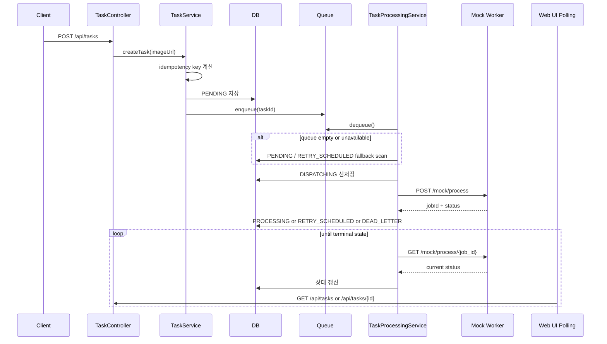
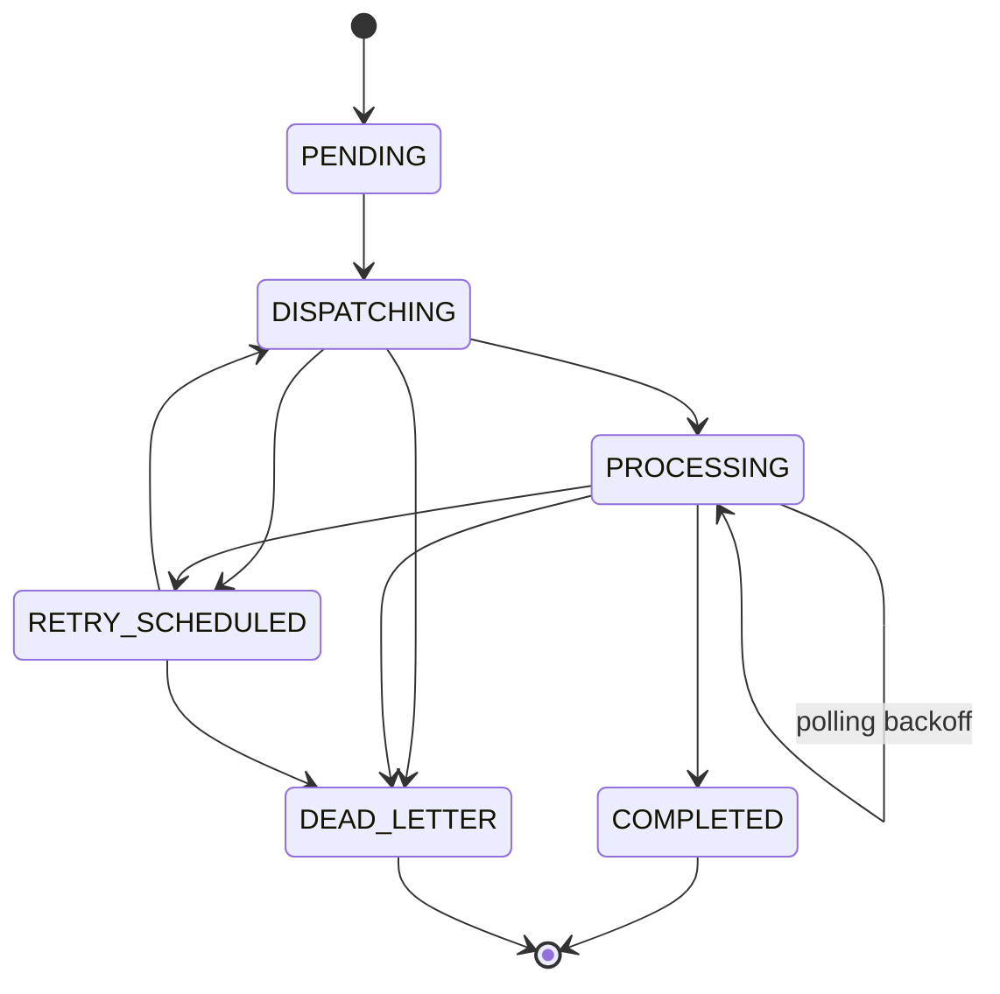

# Realteeth Async Image Processing Demo

Mock Worker API를 감싸는 비동기 이미지 처리 서버입니다.

- 작업 생성, 상태 조회, 결과 조회 API 제공
- Redis queue 기반 비동기 처리
- 명시적인 재시도 예약과 dead-letter 처리
- 재기동 시 `PROCESSING` 재폴링과 `DISPATCHING` 복구
- Thymeleaf 기반 웹 UI
- Docker Compose 실행 지원
- 과제 원문: `docs/assignment.md`

## 1. 기술 스택

- Kotlin 1.9
- Spring Boot 3.2.4
- Spring MVC + Thymeleaf
- Spring Data JPA
- MySQL 8
- Redis 7
- WebClient
- Docker Compose

## 2. 아키텍처 개요

### 2.1 시스템 구성

```mermaid
flowchart TD
    client[Browser / API Client] --> controller[Spring MVC Controller]
    controller --> service[TaskService]
    service --> idempotency[idempotency key 계산]
    service --> db[(MySQL / H2)]
    service --> queue[(Redis Queue / In-Memory Queue)]
    queue --> worker[TaskProcessingService]
    db --> worker
    worker --> recovery[DB fallback scan / restart recovery]
    worker --> retry[retry / dead-letter]
    worker --> mock[MockWorkerClient]
    mock --> issueKey[POST /mock/auth/issue-key]
    mock --> process[POST /mock/process]
    mock --> poll[GET /mock/process/{job_id}]
```

### 2.2 컴포넌트 역할

| 컴포넌트 | 역할 |
|----------|------|
| `TaskController` | 작업 생성, 단건 조회, 목록 조회 API 제공 |
| `TaskPageController` | `/tasks`, `/tasks/{id}/view` 화면 렌더링 |
| `TaskService` | 멱등 처리, task 저장, queue 적재 |
| `TaskProcessingService` | 스케줄 기반 worker, 상태 전이, retry, DLQ, 재기동 복구 |
| `MockWorkerClient` | Mock Worker API key 발급, 작업 등록, 상태 polling |
| `ImageTaskRepository` | task 조회, 상태별 스캔, 정렬 조회 |
| `TaskQueueGateway` | Redis 또는 in-memory queue 추상화 |

### 2.3 패키지 구조

```text
src/main/kotlin/com/realteeth
├── common
│   ├── exception
│   └── validation
├── config
├── infrastructure
│   ├── mockworker
│   └── queue
└── task
    ├── controller
    ├── dto
    ├── entity
    ├── repository
    └── service
```

### 2.4 설계 포인트

- 외부 시스템 연동은 webhook/callback이 아니라 polling 기반입니다.
- worker는 queue만 믿지 않고 DB를 함께 스캔해서 queue 장애나 재기동 이후에도 작업을 이어갑니다.
- `DISPATCHING` 상태를 별도로 둬서 외부 작업 등록 직전의 불확실 구간을 모델링합니다.
- local 프로필은 H2 + in-memory queue, `local-mysql`과 `docker`는 MySQL + Redis 조합입니다.

## 3. 핵심 흐름

1. 클라이언트가 `POST /api/tasks`로 작업을 생성합니다.
2. 서버는 `imageUrl` 기반 `idempotencyKey`를 계산합니다.
3. 중복 요청이면 기존 task를 반환합니다.
4. 신규 요청이면 DB에 `PENDING` 상태로 저장하고 queue에 적재합니다.
5. worker는 queue를 먼저 소비하고, 비어 있으면 DB의 `PENDING`/`RETRY_SCHEDULED` 작업도 직접 확인합니다.
6. dispatch 직전에 task를 먼저 `DISPATCHING`으로 저장한 뒤 Mock Worker에 `/process`를 호출합니다.
7. 외부 job ID를 받으면 `PROCESSING`, 완료되면 `COMPLETED`, 복구 불가능하거나 불확실한 상태면 `DEAD_LETTER`로 전이합니다.

### 3.1 시퀀스



### 3.2 왜 callback이 아닌가

- 과제의 Mock Worker는 상태 조회 API를 제공하므로 polling 방식이 자연스럽습니다.
- 별도 공개 callback URL, 서명 검증, 재전송 정책을 설계하지 않아도 되어 로컬 실행과 검증이 단순합니다.
- polling 실패 시 `externalJobId`를 유지한 채 재조회할 수 있어 복구 경로가 명확합니다.

## 4. 실행 방법

### 로컬 실행

로컬 실행은 H2 + in-memory queue를 사용합니다.

```bash
./gradlew test
./gradlew bootRun --args="--spring.profiles.active=local"
```

접속 주소:

- Web UI: `http://localhost:8080/tasks`
- Swagger UI: `http://localhost:8080/swagger-ui/index.html`

### 로컬 MySQL 실행

로컬에서 MySQL + Redis 조합으로 확인하려면 `local-mysql` 프로필을 사용하면 됩니다.

1. MySQL과 Redis를 먼저 띄웁니다.

```bash
docker compose up -d mysql redis
```

2. 앱을 로컬에서 실행합니다.

```bash
./gradlew bootRun --args="--spring.profiles.active=local-mysql"
```

기본 연결 값:

- MySQL: `localhost:3306`, database `realteeth`, user `realteeth`, password `realteeth`
- Redis: `localhost:6379`

필요하면 아래 환경 변수로 값을 바꿀 수 있습니다.

- `REALTEETH_MYSQL_HOST`
- `REALTEETH_MYSQL_PORT`
- `REALTEETH_MYSQL_DATABASE`
- `REALTEETH_MYSQL_USERNAME`
- `REALTEETH_MYSQL_PASSWORD`
- `REALTEETH_REDIS_HOST`
- `REALTEETH_REDIS_PORT`

### Docker 실행

```bash
docker compose up --build -d
```

접속 주소:

- Web UI: `http://localhost:8080/tasks`
- Swagger UI: `http://localhost:8080/swagger-ui/index.html`

참고:

- MySQL과 Redis는 기본적으로 호스트에서도 접근 가능합니다.
- 포트가 충돌하면 `REALTEETH_MYSQL_PORT`, `REALTEETH_REDIS_PORT`로 변경할 수 있습니다.
- Docker에서는 앱 컨테이너가 시작된 뒤 `8080`이 응답 가능해질 때까지 수십 초 정도 더 걸릴 수 있습니다.

### 종료

```bash
docker compose down --remove-orphans
```

## 5. 환경 변수

Mock Worker API key는 앱이 최초 외부 요청 시 자동 발급합니다.

선택적으로 아래 값을 지정할 수 있습니다.

- `MOCK_WORKER_CANDIDATE_NAME`
- `MOCK_WORKER_CANDIDATE_EMAIL`
- `MOCK_WORKER_API_KEY`
- `REALTEETH_MYSQL_HOST`
- `REALTEETH_MYSQL_PORT`
- `REALTEETH_MYSQL_DATABASE`
- `REALTEETH_MYSQL_USERNAME`
- `REALTEETH_MYSQL_PASSWORD`
- `REALTEETH_REDIS_HOST`
- `REALTEETH_REDIS_PORT`

## 6. API

### 작업 생성

`POST /api/tasks`

```json
{
  "imageUrl": "https://example.com/image.png"
}
```

응답 예시:

```json
{
  "id": 1,
  "status": "PENDING",
  "created": true,
  "message": "Task created successfully"
}
```

중복 요청 응답 예시:

```json
{
  "id": 1,
  "status": "PROCESSING",
  "created": false,
  "message": "Task already exists"
}
```

`created`는 새 task를 저장했는지, 아니면 기존 idempotent task를 재사용했는지를 나타냅니다.

### 작업 단건 조회

`GET /api/tasks/{id}`

응답 예시:

```json
{
  "id": 1,
  "imageUrl": "https://example.com/image.png",
  "status": "PROCESSING",
  "externalJobId": "job-123",
  "result": null,
  "retryCount": 1,
  "maxRetryCount": 3,
  "lastErrorCode": "MOCK_WORKER_POLL_FAILED",
  "lastErrorMessage": "temporary timeout",
  "nextRetryAt": "2026-03-10T12:00:10",
  "startedAt": "2026-03-10T12:00:01",
  "completedAt": null,
  "createdAt": "2026-03-10T12:00:00",
  "updatedAt": "2026-03-10T12:00:02"
}
```

### 작업 목록 조회

- `GET /api/tasks`
- `GET /api/tasks?status=PROCESSING`
- `GET /api/tasks?status=DEAD_LETTER`

## 7. 상태 모델



- `PENDING`: 새 작업이 queue에서 소비되기를 기다리는 상태
- `RETRY_SCHEDULED`: 재시도 시각을 기다리는 상태
- `DISPATCHING`: 외부 `/process` 호출 직전 로컬에 먼저 선반영한 상태
- `PROCESSING`: 외부 job ID를 받은 뒤 상태 polling 중인 상태
- `COMPLETED`: 성공적으로 완료된 상태
- `DEAD_LETTER`: 재시도 불가, 또는 dispatch 결과가 불확실해서 자동 재처리를 멈춘 상태

주요 전이:

- `PENDING -> DISPATCHING`
- `RETRY_SCHEDULED -> DISPATCHING`
- `DISPATCHING -> PROCESSING`
- `DISPATCHING -> RETRY_SCHEDULED`
- `PROCESSING -> COMPLETED`
- `PROCESSING -> RETRY_SCHEDULED`
- `PROCESSING -> PROCESSING` (`nextRetryAt` 기반 poll backoff)
- `DISPATCHING -> DEAD_LETTER`
- `PROCESSING -> DEAD_LETTER`
- `RETRY_SCHEDULED -> DEAD_LETTER`

허용하지 않는 예:

- `COMPLETED -> PROCESSING`
- `DEAD_LETTER -> PROCESSING`
- `PENDING -> COMPLETED`

전이 규칙:

- 상태 변경은 `ImageTask` 엔티티 메서드에서만 수행합니다.
- dispatch 전에는 반드시 `DISPATCHING`을 먼저 저장합니다.
- poll 실패는 새 외부 job을 만들지 않고 기존 `externalJobId`를 유지한 채 다시 poll합니다.

## 8. 중복 요청 처리

중복 요청은 `imageUrl.trim()` 값을 SHA-256으로 해시한 `idempotencyKey`로 처리합니다.

- 동일 요청이면 새 task를 만들지 않습니다.
- 기존 task를 그대로 반환합니다.
- DB unique constraint로 동시 생성 경쟁도 방어합니다.

## 9. 실패 처리 전략

retry 대상:

- Mock Worker dispatch 실패
- Mock Worker가 작업 실패를 반환한 경우
- Mock Worker status polling 실패

retry 정책:

- 최대 재시도 횟수: `3`
- backoff: `10s`, `30s`, `60s`

처리 방식:

- dispatch 실패: `RETRY_SCHEDULED`
- 외부 worker 실패 응답: `RETRY_SCHEDULED`
- polling 실패: 같은 `externalJobId`를 유지한 채 `PROCESSING` 상태에서 `nextRetryAt`만 뒤로 미룹니다.
- 재시도 한도 초과: `DEAD_LETTER`

dead-letter 진입 조건:

- 최대 재시도 횟수 초과
- `PROCESSING` 상태인데 외부 job ID가 없는 경우
- `DISPATCHING` 상태가 오래 남아 dispatch 결과가 불확실한 경우

## 10. 처리 보장 모델

이 구현은 사용자 관점에서는 중복 제거된 task 생성 모델을 제공하고, worker 처리 관점에서는 exactly-once 대신 “중복을 피하려는 보수적 복구”를 택합니다.

이유:

- queue 적재와 외부 API 호출은 분산 트랜잭션이 아닙니다.
- 외부 `/process` 호출 직후 프로세스가 죽으면 외부 job 생성 여부를 100% 알 수 없습니다.
- 이 경우 자동 재전송으로 중복 외부 작업을 만드는 대신, `DISPATCHING` 상태를 `DEAD_LETTER`로 보내 수동 확인 대상으로 남깁니다.

## 11. 서버 재시작 시 동작

앱이 다시 뜨면 별도 startup listener 없이 다음 스케줄 주기에서 자연스럽게 이어집니다.

- `PENDING`, `RETRY_SCHEDULED`: queue가 비어 있어도 DB에서 다시 찾아 실행합니다.
- `PROCESSING`: 저장된 `externalJobId`를 기준으로 정기 polling을 다시 시작합니다.
- `DISPATCHING`: 오래 남아 있으면 결과가 불확실하다고 보고 `DEAD_LETTER`로 이동합니다.
- `COMPLETED`, `DEAD_LETTER`: 그대로 둡니다.

이 선택의 trade-off:

- 불확실한 dispatch를 자동 재전송하지 않아서 중복 외부 실행을 줄입니다.
- 대신 일부 task는 `DEAD_LETTER`로 가서 사람이 확인해야 할 수 있습니다.

## 12. 외부 시스템 연동 방식

Mock Worker API는 아래 순서로 사용합니다.

1. `POST /mock/auth/issue-key`
2. `POST /mock/process`
3. `GET /mock/process/{job_id}`

선택 이유:

- 작업 등록과 상태 조회가 분리되어 있어 비동기 모델과 잘 맞습니다.
- 외부 시스템이 느리거나 불안정하다는 가정에 대응하기 쉽습니다.
- polling 실패 시 외부 job을 잃지 않고 상태 조회만 재시도할 수 있습니다.

## 13. 웹 UI

- `/tasks`: 작업 생성 폼 + 작업 목록
- `/tasks/{id}/view`: 작업 상세

polling 주기:

- 목록: 3초
- 상세: 2초

terminal state(`COMPLETED`, `DEAD_LETTER`)에 도달하면 polling을 멈춥니다.

## 14. 데이터 모델 요약

핵심 엔티티는 `ImageTask` 하나입니다.

| 필드 | 설명 |
|------|------|
| `id` | 내부 task 식별자 |
| `idempotencyKey` | `imageUrl.trim()` 기준 SHA-256 해시 |
| `imageUrl` | 처리 대상 이미지 URL |
| `status` | 현재 상태 |
| `externalJobId` | Mock Worker job id |
| `resultPayload` | 최종 결과 raw payload |
| `retryCount` / `maxRetryCount` | 재시도 카운터 |
| `lastErrorCode` / `lastErrorMessage` | 마지막 실패 원인 |
| `nextRetryAt` | 다음 retry 또는 poll 가능 시각 |
| `startedAt` / `completedAt` | 처리 시작/종료 시각 |
| `createdAt` / `updatedAt` | 감사용 타임스탬프 |

## 15. 병목 가능 지점

- DB polling 빈도가 높아지면 `PROCESSING` 조회 비용 증가 가능
- queue에 task가 몰리면 dispatch 처리량이 병목이 될 수 있음
- 외부 Mock Worker latency가 길어지면 end-to-end 지연 증가

확장 아이디어:

- polling batch size 조정
- multiple consumer 확장
- 재시도용 delayed queue를 Redis sorted set 또는 외부 MQ로 분리
- `DEAD_LETTER` 재처리 전용 API/관리 화면 추가

## 16. 테스트

자동 테스트:

- context load
- 중복 요청 처리 테스트
- unique constraint 경쟁 시 기존 task 반환 테스트
- dispatch 전 `DISPATCHING` 선저장 테스트
- polling 실패 시 `externalJobId` 보존 테스트
- retry exhaustion 시 `DEAD_LETTER` 전이 테스트
- stale `DISPATCHING` 복구 테스트
- 컨트롤러 validation / 404 / 잘못된 status 파라미터 테스트

실행:

```bash
./gradlew test
```

JaCoCo 리포트:

- HTML: `build/reports/jacoco/test/html/index.html`
- XML: `build/reports/jacoco/test/jacocoTestReport.xml`

## 17. 수동 확인용 테스트 데이터

가장 쉬운 방법은 API로 샘플 task를 여러 개 생성하는 것입니다. 이렇게 하면 DB만 채우는 게 아니라 실제 queue/worker 흐름도 같이 검증할 수 있습니다.

PowerShell 스크립트:

```powershell
powershell -ExecutionPolicy Bypass -File .\docs\seed-sample-tasks.ps1
```

옵션:

- 기본 5건 생성: `powershell -ExecutionPolicy Bypass -File .\docs\seed-sample-tasks.ps1`
- 개수 지정: `powershell -ExecutionPolicy Bypass -File .\docs\seed-sample-tasks.ps1 -Count 3`
- 중복 요청까지 같이 확인: `powershell -ExecutionPolicy Bypass -File .\docs\seed-sample-tasks.ps1 -IncludeDuplicate`
- 다른 서버에 적재: `powershell -ExecutionPolicy Bypass -File .\docs\seed-sample-tasks.ps1 -BaseUrl http://localhost:18080`

이 스크립트는 공개 이미지 URL을 이용해 `POST /api/tasks`를 호출하고, 생성된 task id와 상태를 표 형태로 출력합니다.

### 17.1 수동 검증 체크리스트

1. 샘플 task 생성 후 `/tasks`에서 `PENDING -> DISPATCHING -> PROCESSING -> COMPLETED/DEAD_LETTER` 전이가 보이는지 확인합니다.
2. 같은 URL로 다시 생성해서 `created=false`와 동일 task id가 반환되는지 확인합니다.
3. `/api/tasks?status=DEAD_LETTER`로 실패 task만 필터링되는지 확인합니다.
4. 앱을 종료 후 다시 실행해 `PROCESSING` task가 polling을 이어가는지 확인합니다.
5. Redis를 일시적으로 중단한 뒤 새 task 생성 시 API는 성공하고, 앱 재기동 후 DB scan fallback으로 작업이 회복되는지 확인합니다.

## 18. 빠른 실행

### 가장 빠른 방법

```bash
docker compose up --build -d
```

- Web UI: `http://localhost:8080/tasks`
- Swagger UI: `http://localhost:8080/swagger-ui/index.html`

샘플 데이터 적재:

```powershell
powershell -ExecutionPolicy Bypass -File .\docs\seed-sample-tasks.ps1
```

종료:

```bash
docker compose down --remove-orphans
```

### 로컬 MySQL로 실행

```bash
docker compose up -d mysql redis
./gradlew bootRun --args="--spring.profiles.active=local-mysql"
```

### 로컬 H2로 실행

```bash
./gradlew bootRun --args="--spring.profiles.active=local"
```
